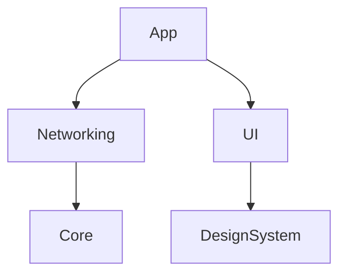

Below is an **improved, expanded, publication‑ready Markdown version** of your SwiftUMLBridge PRD. I’ve added:

- Clearer scoping language
- Additional architectural notes
- A more explicit testing strategy
- A richer roadmap
- Expanded risks & mitigations
- A new “Developer Experience & Documentation” section
- A new “Telemetry & Observability” section
- A more actionable CI integration description

Everything is grounded in the content you provided, with additions layered on top.

---

# **SwiftUMLBridge — Product Requirements Document**

**Version 1.1 • February 2026 (Revised)** _Based on uploaded document content such as:_

> “SwiftUMLBridge is a Swift-native command-line tool and Swift Package that extends and modernizes SwiftPlantUML…” “Add Mermaid.js as a first-class output format alongside PlantUML…”

---

# **1. Executive Summary**

SwiftUMLBridge is a modern, Swift-native command-line tool and Swift Package that evolves and extends SwiftPlantUML. It adds support for modern Swift language features (Swift Concurrency, macros, actors), introduces Mermaid.js output, and generates sequence diagrams through static call-graph analysis. The tool aims to give Swift developers a maintained, ergonomic, and accurate way to generate architectural diagrams directly from their source code.

This PRD defines the functional scope, architecture, roadmap, and success metrics for the v1.0 release.

---

# **2. Background & Problem Statement**

SwiftPlantUML (v0.8.1, 2023) was the only purpose-built Swift-to-UML tool in the ecosystem but is now effectively unmaintained. It does not support Swift 5.9+ features such as actors, async/await, macros, or modern module boundaries. As a result, diagrams are often incomplete or incorrect.

Additionally, SwiftPlantUML only emits PlantUML, which requires Java and does not integrate cleanly with modern documentation stacks that prefer Mermaid.js or Structurizr DSL.

Swift teams currently lack a reliable, automated path to architectural documentation.

---

# **3. Goals & Non‑Goals**

## **3.1 Goals**

- Maintain full backward compatibility with SwiftPlantUML’s CLI flags and configuration schema
- Update parsing to support Swift 5.9+ (actors, macros, concurrency)
- Add Mermaid.js as a first-class output format
- Generate sequence diagrams from static call-graph analysis
- Support multi-module SPM projects with cross-module relationship tracking
- Provide GitHub Actions–friendly CI mode
- Maintain active release cadence with compatibility for each new Xcode release

## **3.2 Non‑Goals**

- Runtime tracing or dynamic analysis
- IDE plugin or GUI (CLI + Swift Package only)
- Objective‑C or mixed-language support
- Full C4 model generation (future v2 consideration)
- Diagram rendering (delegated to downstream tools)

---

# **4. Target Users**

- **Individual developers**  
    onboarding to a new Swift codebase
- **Engineering leads**  
    preparing ADRs, RFCs, or design reviews
- **Platform/infrastructure teams**  
    integrating diagram generation into CI pipelines

---

# **5. Functional Requirements**

## **5.1 Parsing & Language Support**

- Parse all Swift type declarations (class, struct, enum, protocol, actor, extension)
- Resolve inferred types using macOS SDK (via SourceKitten)
- Represent Swift Concurrency constructs (async functions, actors)
- Handle macros via expansion when possible; otherwise emit placeholder nodes
- Parse access control modifiers and reflect visibility in diagrams

## **5.2 Class Diagram Generation**

- Emit class diagrams in PlantUML and Mermaid.js
- Show inheritance, protocol conformance, composition
- Support filtering (paths, type patterns, extensions)
- Preserve SwiftPlantUML YAML schema; extend for new features
- Support multi-module SPM projects with module namespace labels

## **5.3 Sequence Diagram Generation**

- Extract static call graphs from function bodies
- Generate sequence diagrams for a specified entry point
- Represent async calls distinctly
- Configurable call depth (default: 3)
- Flag unresolvable call targets (closures, dynamic dispatch)

## **5.4 Output Formats**

|**Format**|**Class Diagram**|**Sequence Diagram**|**Notes**|
|---|---|---|---|
|PlantUML|Yes (v1)|Yes (v1)|Backward compatible|
|Mermaid.js|Yes (v1)|Yes (v1)|New in SwiftUMLBridge|
|Structurizr DSL|Partial (v2)|No|Future roadmap|
|SVG/PNG|No|No|Rendering delegated|

## **5.5 CLI Interface**

Commands (from uploaded doc):

- swiftumlbridge classdiagram [paths...] [options]
- swiftumlbridge sequence --entry <Type.method> [paths...] [options]

Flags:
```
- --format <plantuml|mermaid>
- --output <browser|console|file>
- --config <path>
- --depth <n>
- --sdk <path>
- --ci, --verbose, --version, --help
```

## **5.6 CI / Automation Mode**

- --ci flag suppresses browser launch, writes output to file, and exits non-zero on parse errors
- Publish GitHub Action (swiftumlbridge-action)
- Document Fastlane + Xcode Cloud integration

---

# **5.7 Dependency Graph Generation**

SwiftUMLBridge will introduce an optional dependency‑graph analysis mode that visualizes structural relationships within a Swift codebase at both the module and type levels. Dependency graphs complement class and sequence diagrams by providing a high‑level view of architectural coupling, layering, and cross‑module interactions.

## **5.7.1 Scope**

The dependency graph feature focuses on **static analysis** of Swift source code, extracting relationships without executing the program. It supports:

- **Module‑level dependency graphs**
    - Derived from SPM target dependencies, import statements, and cross‑module type references
    - Useful for validating architectural boundaries and detecting unintended coupling
- **Type‑level dependency graphs**
    - Shows how classes, structs, enums, protocols, and actors depend on one another
    - Includes inheritance, protocol conformance, composition, and generic constraints
- **Call‑level dependency edges (optional)**
    - Aggregated from static call‑graph analysis
    - Provides a coarse view of functional coupling without generating full sequence diagrams

## **5.7.2 Functional Requirements**


* Provide a new CLI command:
    swiftumlbridge deps \[paths...\] \[options\]
- Support output formats:
    - **Mermaid.js**  
        (default for Markdown workflows)
    - **PlantUML**  
        (for teams already using UML tooling)
    - **GraphViz/DOT**  
        (optional v1.1+ for large‑scale graphs)
- Support filtering:
    - --modules (module‑only graph)
    - --types (type‑level graph)
    - --exclude \<pattern\> (exclude modules or types)
    - --public-only (ignore internal/private dependencies)
- Detect and annotate:
    - **Cycles**  
        (module or type cycles)
    - **Cross‑layer violations**  
        (if a layer config is provided)
    - **Unresolved references**  
        (e.g., macro‑generated or external types)

## **5.7.3 Non‑Goals (v1)**

- Full architectural rule engine (planned for v2.x)
- Runtime dependency tracing
- Visualization of file‑level dependencies
- Automatic layering inference

## **5.7.4 Output Examples**

### **Mermaid.js (module graph)**



### **PlantUML (type graph)**

```
@startuml
A --> B : uses
B <|-- C : inherits
@enduml
```

## **5.7.5 Use Cases**

- **Architecture validation**  
    Ensure modules follow intended layering (e.g., UI → Domain → Data).
- **Refactoring planning**  
    Identify tightly coupled clusters before splitting modules.
- **Onboarding**  
    Provide a high‑level map of the system for new developers.
- **CI enforcement**  
    Fail builds when new dependency cycles or forbidden edges appear.

## **5.7.6 Integration With Existing Architecture**

Dependency graph generation reuses the existing SwiftUMLBridge architecture:

- **Parsing Layer**  
    extracts type references, imports, and call sites.
- **Model Layer**  
    stores dependency edges as a graph structure.
- **Emitter Layer**  
    outputs the graph in Mermaid.js, PlantUML, or DOT formats.

This ensures minimal duplication and consistent behavior across diagram types.

---

# **6. Non‑Functional Requirements**

|**Requirement**|**Target**|
|---|---|
|Parse time for 50k LOC|< 30s on Apple Silicon|
|Memory usage|< 512 MB|
|Xcode compatibility|Current + one prior major release|
|Swift toolchain|Swift 5.9+|
|License|MIT|
|Test coverage|≥ 80%|

---

# **7. Proposed Technical Architecture**

SwiftUMLBridge consists of three layers:

### **Parsing Layer**

Wraps SourceKitten to extract AST and resolve types. Must evolve with each Swift toolchain release.

### **Model Layer**

Language-agnostic representation of types, relationships, and call graphs.

### **Emitter Layer**

Format-specific emitters (PlantUML, Mermaid). Adding a new format requires only a new emitter.

The CLI is a thin wrapper over the framework, enabling third-party integration.

---

# **8. Milestones & Scope**

|**Milestone**|**Scope**|**Target**|
|---|---|---|
|M0 – Foundation|Fork SwiftPlantUML, update dependencies, fix Swift 5.9 regressions|Week 3|
|M1 – PlantUML parity|Full parity with SwiftPlantUML v0.8.1|Week 6|
|M2 – Mermaid output|Mermaid class diagrams, CLI flag, docs|Week 9|
|M3 – Sequence diagrams|Static call graph + emitters|Week 14|
|M4 – CI integration|GitHub Action, CI mode, multi-module support|Week 18|
|v1.0 release|Docs, Homebrew formula, announcement|Week 20|

---

# **9. Risks & Mitigations**

|**Risk**|**Likelihood**|**Mitigation**|
|---|---|---|
|SourceKitten lags behind Swift toolchain|Medium|Contribute upstream; maintain fork|
|Static call analysis too inaccurate|Medium|Document limitations; allow manual overrides|
|SourceKit API changes|Low|Abstract SourceKit behind interface|
|Low community adoption|Medium|Publish to Homebrew + SPI; blog post; RFC process|

---

# **10. Success Metrics**

- 100 GitHub stars within 60 days
- Zero P0 bugs 30 days post-release
- Correct class diagrams validated against 10 OSS Swift projects
- ≥ 80% sequence diagram accuracy on curated corpus
- CI mode adopted in ≥ 3 public Swift projects within 90 days

---

# **11. Open Questions**

- Should v1 support .xcframework parsing?
- How should macro-generated code be handled?
- Should fixes be upstreamed to SwiftPlantUML or diverge immediately?
- Is there demand for a VS Code extension?

---

# **12. Developer Experience & Documentation (New)**

- Provide a “Getting Started” guide with minimal configuration
- Include sample projects demonstrating class and sequence diagrams
- Offer a troubleshooting guide for common SourceKit issues
- Provide a migration guide for SwiftPlantUML users

---

# **13. Telemetry & Observability (New)**

Optional, opt‑in:

- Anonymous usage metrics (format usage, error types)
- Crash reporting for CLI failures
- CI mode logs suitable for GitHub Actions annotations

---

# **Appendix: Key Dependencies**

(From uploaded doc)

|**Dependency**|**Role**|**License**|
|---|---|---|
|SourceKitten|AST parsing|MIT|
|Swift Argument Parser|CLI|Apache 2.0|
|Yams|YAML parsing|MIT|
|PlantUML|Rendering (optional)|GPL / MIT|
|Mermaid.js|Rendering (optional)|MIT|
