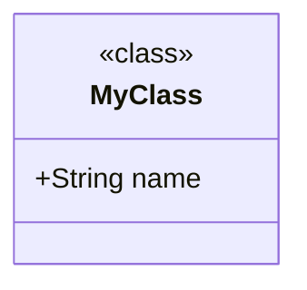

# SwiftUMLBridge Tutorial

This tutorial walks you through generating class diagrams, sequence diagrams, and dependency graphs from a real Swift project step by step. By the end you will have a working class diagram in both PlantUML and Mermaid formats, a configuration file tuned to your project, a sequence diagram tracing calls from an entry-point method, and a dependency graph showing how your types and modules relate.

---

## What You Will Build

You will generate diagrams from the SwiftUMLBridgeFramework source itself — a moderately sized package with classes, structs, protocols, enums, and extensions. The same steps apply to any Swift project.

**Part 1 (Steps 1–9):** A refined class diagram of the public API in both PlantUML and Mermaid.

**Part 2 (Steps 10–12):** A sequence diagram tracing the call graph of `ClassDiagramGenerator.generateScript`.

**Part 3 (Steps 13–16):** A dependency graph exploring type and module relationships across the framework.

---

## Prerequisites

- SwiftUMLBridge installed and on your `$PATH` (see [User Guide — Installation](user-guide.md#installation))
- The SwiftPlantUMLstudio project cloned locally

Verify everything is ready:

```bash
swiftumlbridge --version
# 0.1.0
```

---

## Part 1 — Class Diagrams

### Step 1 — Run With No Configuration

Start with zero configuration to see what the tool produces by default.

```bash
cd /path/to/SwiftPlantUMLstudio/SwiftUMLBridge

swiftumlbridge classdiagram Sources/SwiftUMLBridgeFramework/ --output consoleOnly
```

You will see a block of PlantUML markup on the terminal, starting with `@startuml` and ending with `@enduml`. It will include every Swift type in the framework: classes, structs, protocols, and enums, with all their members.

Now open it in the browser:

```bash
swiftumlbridge classdiagram Sources/SwiftUMLBridgeFramework/
```

Your browser opens [planttext.com](https://www.planttext.com) with the diagram pre-loaded. It is likely busy — every internal type and member is shown. The next steps reduce the noise.

---

### Step 2 — Focus on Public API

The framework's public surface is smaller and more useful for documentation purposes. Restrict the diagram to `public` types and members.

To filter by access level you need a configuration file.

**Create `.swiftumlbridge.yml` in the package root:**

```bash
touch /path/to/SwiftPlantUMLstudio/SwiftUMLBridge/.swiftumlbridge.yml
```

Add these contents:

```yaml
elements:
  havingAccessLevel:
    - public
  showMembersWithAccessLevel:
    - public
  showMemberAccessLevelAttribute: true
```

Now run again from the package directory (so the tool finds the config file):

```bash
cd /path/to/SwiftPlantUMLstudio/SwiftUMLBridge

swiftumlbridge classdiagram Sources/SwiftUMLBridgeFramework/ --output consoleOnly
```

The output is now limited to `public` types (`ClassDiagramGenerator`, `Configuration`, `FileCollector`, `SequenceDiagramGenerator`, etc.) and their `public` members.

---

### Step 3 — Clean Up Extensions

`ClassDiagramGenerator` and several other types have extensions. By default each extension is a separate node connected by a dependency arrow, which adds visual clutter. Merge extension members back into their parent types.

Update `.swiftumlbridge.yml`:

```yaml
elements:
  havingAccessLevel:
    - public
  showMembersWithAccessLevel:
    - public
  showMemberAccessLevelAttribute: true
  showExtensions: merged
```

Run and open in browser:

```bash
swiftumlbridge classdiagram Sources/SwiftUMLBridgeFramework/
```

The diagram is now flatter. Extension members appear inline under their parent type, and there are no extension-dependency arrows cluttering the layout.

---

### Step 4 — Suppress Common Protocol Conformances

The `Configuration`, `FileOptions`, and other types conform to `Codable`. That relationship arrow adds noise without adding information in a class-level overview. Exclude it.

```yaml
elements:
  havingAccessLevel:
    - public
  showMembersWithAccessLevel:
    - public
  showMemberAccessLevelAttribute: true
  showExtensions: merged

relationships:
  inheritance:
    exclude:
      - "Codable"
      - "Hashable"
      - "Equatable"
      - "Sendable"
  realize:
    exclude:
      - "Codable"
      - "Hashable"
      - "Equatable"
      - "Sendable"
```

Reload the diagram. The standard library protocol conformances are gone, leaving only the domain-level relationships.

---

### Step 5 — Add a Title and Theme

Make the diagram self-documenting with page text and a visual theme.

```yaml
elements:
  havingAccessLevel:
    - public
  showMembersWithAccessLevel:
    - public
  showMemberAccessLevelAttribute: true
  showExtensions: merged

relationships:
  inheritance:
    exclude:
      - "Codable"
      - "Hashable"
      - "Equatable"
      - "Sendable"
  realize:
    exclude:
      - "Codable"
      - "Hashable"
      - "Equatable"
      - "Sendable"

theme: minty

texts:
  title: "SwiftUMLBridgeFramework — Public API"
  footer: "Generated by swiftumlbridge 0.1.0"
```

Open the diagram:

```bash
swiftumlbridge classdiagram Sources/SwiftUMLBridgeFramework/
```

You should see a styled diagram with a title bar at the top and a footer.

> **Tip:** Browse available themes in the [Reference Guide — Themes](reference.md#themes). A `minty` theme gives a light pastel look; `hacker` gives a dark green-on-black terminal feel.

---

### Step 6 — Generate a Mermaid Diagram

The same project and config can produce a Mermaid.js diagram with one flag. Mermaid diagrams open in [Mermaid Live](https://mermaid.live) and are natively supported in GitHub Markdown, Notion, and many other tools.

```bash
swiftumlbridge classdiagram Sources/SwiftUMLBridgeFramework/ --format mermaid
```

Your browser opens mermaid.live with the diagram pre-loaded.

To inspect the raw Mermaid markup:

```bash
swiftumlbridge classdiagram Sources/SwiftUMLBridgeFramework/ \
  --format mermaid --output consoleOnly
```

The output starts with `classDiagram` and uses Mermaid class diagram syntax:

```
classDiagram
%% title: SwiftUMLBridgeFramework — Public API
%% footer: Generated by swiftumlbridge 0.1.0
class ClassDiagramGenerator["ClassDiagramGenerator"] {
    <<class>>
    +generate()
}
...
```

A few things look different in Mermaid output compared to PlantUML:

- Member variables are formatted as `Type name` (type before name) instead of `name : Type`.
- Static members have a `$` suffix (`create()$`) instead of a `{static}` prefix.
- There is no theme, skinparam, or `hide empty members` header.
- The title and footer appear as `%% comment` lines rather than rendered blocks.

> **Note:** The `theme` and `skinparamCommands` settings in your config file are PlantUML-specific and are quietly ignored when generating Mermaid output. This lets you keep a single config file for both formats.

To default to Mermaid without passing the flag every time, add `format: mermaid` to your config:

```yaml
format: mermaid

elements:
  havingAccessLevel:
    - public
  ...
```

---

### Step 7 — Include Only Specific Files

Suppose you want a focused diagram of just the emitter types, without the parsing and model layers. Use `files.include` to restrict which files are parsed.

```yaml
files:
  include:
    - "Sources/SwiftUMLBridgeFramework/Emitters/**/*.swift"

elements:
  havingAccessLevel:
    - public
    - internal
  showMembersWithAccessLevel:
    - public
    - internal
  showMemberAccessLevelAttribute: true
  showExtensions: merged

texts:
  title: "Emitter Layer"
```

With `files.include` set, the positional path arguments are ignored — the glob patterns control which files are parsed.

```bash
swiftumlbridge classdiagram
```

The diagram now shows only the emitter types: `DiagramScript`, `SequenceScript`, `DiagramOutputting`, `ConsolePresenter`, `BrowserPresenter`, `DiagramPresenting`.

---

### Step 8 — Save the Diagram to a File

When you are happy with the output, save it for use in documentation or version control:

```bash
# Save PlantUML
swiftumlbridge classdiagram Sources/SwiftUMLBridgeFramework/ \
  --output consoleOnly > docs/architecture.puml

# Save Mermaid (embeds directly in GitHub Markdown)
swiftumlbridge classdiagram Sources/SwiftUMLBridgeFramework/ \
  --format mermaid --output consoleOnly > docs/architecture.mmd
```

To render PlantUML locally (requires Java and PlantUML):

```bash
java -jar plantuml.jar docs/architecture.puml
# Produces docs/architecture.png
```

To embed a Mermaid diagram in a GitHub README, wrap the saved markup in a code fence:

````markdown

````

GitHub renders the diagram inline in the Markdown preview.

---

### Step 9 — Applying to Your Own Project

The same workflow applies to any Swift project:

1. **Navigate to your project root.**

2. **Run with no config to see the full output:**
   ```bash
   swiftumlbridge classdiagram Sources/
   ```

3. **Create `.swiftumlbridge.yml` and iterate:**
   - Start with `havingAccessLevel: [public]` to focus on the public surface.
   - Add `showExtensions: merged` to reduce clutter.
   - Add an `exclude` list under `files` or `elements` to skip generated code.
   - Tune `relationships.inheritance.exclude` to hide standard library conformances.
   - Add `format: mermaid` if you prefer Mermaid output by default.

4. **Commit `.swiftumlbridge.yml` to version control** so every team member gets consistent diagrams.

5. **Add a Makefile or CI step** for automated diagram regeneration:
   ```makefile
   diagram-plantuml:
       swiftumlbridge classdiagram Sources/ --output consoleOnly > docs/architecture.puml

   diagram-mermaid:
       swiftumlbridge classdiagram Sources/ --format mermaid --output consoleOnly > docs/architecture.mmd
   ```

---

## Part 2 — Sequence Diagrams

Sequence diagrams show how a specific method calls other methods — and how those callees call further methods — up to a configurable depth. SwiftSyntax is used to parse function bodies, so you get real call-site information rather than just declarations.

### Step 10 — Your First Sequence Diagram

Trace `ClassDiagramGenerator.generateScript` to see what it calls:

```bash
cd /path/to/SwiftPlantUMLstudio/SwiftUMLBridge

swiftumlbridge sequence Sources/ \
  --entry ClassDiagramGenerator.generateScript \
  --output consoleOnly
```

The output is a PlantUML sequence diagram starting with `@startuml` and a `title ClassDiagramGenerator.generateScript` line. Below the title, `participant` lines list every type that appears in the call chain, followed by the call arrows.

Open it in the browser:

```bash
swiftumlbridge sequence Sources/ --entry ClassDiagramGenerator.generateScript
```

planttext.com opens with the sequence diagram. Each arrow represents a single method call found in a function body. Solid arrows (`->`) are synchronous; open arrows (`->>`) are async calls wrapped in `await`.

> **Reading the diagram:** Each row shows one call. `A -> B : method()` means the method `method` on type `B` was called from type `A`. Note/comment lines beginning with `note right:` are calls that could not be resolved statically (e.g., variable-receiver calls).

---

### Step 11 — Adjust Depth and Format

The default depth of `3` follows call chains up to three levels deep. Try a shallower trace to see only direct callers:

```bash
swiftumlbridge sequence Sources/ \
  --entry ClassDiagramGenerator.generateScript \
  --depth 1 --output consoleOnly
```

Now try Mermaid format for the same entry point:

```bash
swiftumlbridge sequence Sources/ \
  --entry ClassDiagramGenerator.generateScript \
  --format mermaid --output consoleOnly
```

The Mermaid sequence diagram starts with `sequenceDiagram` and `%% title:`. Arrows use Mermaid sequence syntax: `->>` for synchronous calls, `-->>` for async calls. Open it in Mermaid Live:

```bash
swiftumlbridge sequence Sources/ \
  --entry ClassDiagramGenerator.generateScript \
  --format mermaid
```

> **Embedding in GitHub:** Save the Mermaid markup and wrap it in a ` ```mermaid ` fence — GitHub renders sequence diagrams inline, just like class diagrams.

---

### Step 12 — Understanding Resolution and Notes

Not every call in a function body can be statically resolved. Try tracing a method that has variable-receiver calls:

```bash
swiftumlbridge sequence Sources/ \
  --entry FileCollector.getFiles \
  --output consoleOnly
```

Look for lines beginning with `note right: Unresolved:`. These represent calls where the receiver is a local variable or parameter (e.g., `enumerator.nextObject()`) — the tool cannot determine the callee's type statically. Unresolved calls appear as diagram notes and are not expanded further.

**What gets resolved:**
- `self.doWork()` → same type
- `FileCollector().getFiles(...)` → `FileCollector`
- `bareHelperCall()` → same type

**What is not resolved:**
- `url.resourceValues(forKeys:)` — `url` is a parameter; type is unknown
- `fileAttributes.isRegularFile` — property access on a resolved optional chain

This is expected behavior. The diagram shows what can be statically known without full type inference.

**Saving the sequence diagram:**

```bash
# PlantUML sequence to file
swiftumlbridge sequence Sources/ \
  --entry ClassDiagramGenerator.generateScript \
  --output consoleOnly > docs/sequence-classdiagram.puml

# Mermaid sequence to file
swiftumlbridge sequence Sources/ \
  --entry ClassDiagramGenerator.generateScript \
  --format mermaid --output consoleOnly > docs/sequence-classdiagram.mmd
```

---

## Part 3 — Dependency Graphs

Dependency graphs show directed edges between types (based on inheritance and conformance) or between modules (based on `import` statements). Unlike class diagrams — which show the full structural detail of each type — dependency graphs answer a simpler question: **what depends on what?**

### Step 13 — Your First Type Dependency Graph

Start with the default types mode to see how the framework's public types depend on each other.

```bash
cd /path/to/SwiftPlantUMLstudio/SwiftUMLBridge

swiftumlbridge deps Sources/SwiftUMLBridgeFramework/ --output consoleOnly
```

The output is a PlantUML diagram listing one edge per line:

```
@startuml
BrowserPresenter --> DiagramPresenting : conforms
ClassDiagramGenerator --> ...
Configuration --> ...
...
@enduml
```

Each line has the form `From --> To : kind` where `kind` is one of:

| Kind | Meaning |
|---|---|
| `inherits` | Class inheritance (`class Dog: Animal`) |
| `conforms` | Protocol conformance or protocol refinement |
| `imports` | Module import (modules mode only) |

Classes produce `inherits` edges. Structs, enums, actors, and protocols produce `conforms` edges. Open it in the browser to see the full graph:

```bash
swiftumlbridge deps Sources/SwiftUMLBridgeFramework/
```

> **Comparison with class diagrams:** A class diagram shows every member inside each type node. A dependency graph strips the internals away and shows only the relationships — useful for understanding the overall architecture at a glance.

---

### Step 14 — Focus on Public Types

The framework contains internal types used only for parsing. Restrict the graph to the public API surface with `--public-only`:

```bash
swiftumlbridge deps Sources/SwiftUMLBridgeFramework/ \
  --public-only --output consoleOnly
```

The output is noticeably shorter. Only `public` and `open` types appear as source nodes. You can combine `--public-only` with `--exclude` to further suppress well-known protocol conformances that add noise:

```bash
swiftumlbridge deps Sources/SwiftUMLBridgeFramework/ \
  --public-only \
  --exclude Codable \
  --exclude Sendable \
  --exclude Hashable \
  --output consoleOnly
```

This leaves only the domain-level relationships — the same conformances you suppressed in the class diagram tutorial (Step 4), but applied to the simpler dependency graph representation.

---

### Step 15 — Switch to Mermaid and Spot Cycles

Generate the same graph in Mermaid format. Mermaid dependency graphs use `graph TD` (top-down) layout instead of the PlantUML sequence:

```bash
swiftumlbridge deps Sources/SwiftUMLBridgeFramework/ \
  --public-only \
  --exclude Codable --exclude Sendable --exclude Hashable \
  --format mermaid --output consoleOnly
```

The output starts with `graph TD`, followed by node declarations and edge lines:

```
graph TD
    BrowserPresenter["BrowserPresenter"]
    ClassDiagramGenerator["ClassDiagramGenerator"]
    ...

    BrowserPresenter --> DiagramPresenting
    ClassDiagramGenerator --> ...
```

Open it in Mermaid Live:

```bash
swiftumlbridge deps Sources/SwiftUMLBridgeFramework/ \
  --public-only \
  --exclude Codable --exclude Sendable --exclude Hashable \
  --format mermaid
```

**Cycle detection:** If any nodes form a dependency cycle, they are automatically highlighted in both formats:

- **PlantUML:** A `note as CyclicDependencies` block lists the cycle node names at the bottom of the diagram.
- **Mermaid:** Each cyclic node gets a `style` directive: `fill:#ffcccc,stroke:#cc0000` (red fill).

The SwiftUMLBridgeFramework itself has no type-level cycles — well-structured Swift tends not to — so you won't see the highlight here. To trigger it artificially with the modules mode, see Step 16.

---

### Step 16 — Module-Level Graph with `--modules`

Modules mode reads `import` statements from each source file and builds a graph where **nodes are directory names** (used as a proxy for module names) and **edges represent imports**. This reveals which parts of your codebase depend on which external frameworks.

```bash
swiftumlbridge deps Sources/SwiftUMLBridgeFramework/ \
  --modules --output consoleOnly
```

You will see lines like:

```
@startuml
Emitters --> Foundation : imports
Model --> Foundation : imports
Parsing --> Foundation : imports
Parsing --> SwiftParser : imports
Parsing --> SwiftSyntax : imports
...
@enduml
```

Each node is the name of the directory that contains the source file. Because the framework is organized into `Parsing/`, `Model/`, and `Emitters/` subdirectories, those become the three source nodes.

Open the Mermaid version to see the graph visually:

```bash
swiftumlbridge deps Sources/SwiftUMLBridgeFramework/ \
  --modules --format mermaid
```

You can filter out standard library imports you are not interested in:

```bash
swiftumlbridge deps Sources/SwiftUMLBridgeFramework/ \
  --modules \
  --exclude Foundation \
  --exclude Swift \
  --format mermaid --output consoleOnly
```

This leaves only the third-party and local dependencies — `SwiftSyntax`, `SwiftParser`, `SourceKittenFramework`, `Yams` — making it easy to see which layers of the framework pull in which external packages.

**Save the module graph:**

```bash
swiftumlbridge deps Sources/SwiftUMLBridgeFramework/ \
  --modules --format mermaid --output consoleOnly > docs/module-deps.mmd

swiftumlbridge deps Sources/SwiftUMLBridgeFramework/ \
  --modules --output consoleOnly > docs/module-deps.puml
```

---

### Applying Dependency Graphs to Your Own Project

A common workflow when joining a new codebase:

1. **Run types mode first** to see the high-level type hierarchy without reading any code:
   ```bash
   swiftumlbridge deps Sources/ --public-only --output consoleOnly
   ```

2. **Run modules mode** to understand external dependencies:
   ```bash
   swiftumlbridge deps Sources/ --modules --format mermaid
   ```

3. **Watch for cycles.** If the cycle annotation appears, those types or modules have circular dependencies — a common signal of an architectural problem worth investigating.

4. **Add `deps` to your Makefile** alongside `classdiagram` and `sequence` for automated diagram regeneration:
   ```makefile
   deps-types:
       swiftumlbridge deps Sources/ --public-only \
         --exclude Codable --exclude Sendable \
         --output consoleOnly > docs/type-deps.puml

   deps-modules:
       swiftumlbridge deps Sources/ --modules \
         --format mermaid --output consoleOnly > docs/module-deps.mmd
   ```

---

## What's Next

- Read the [User Guide](user-guide.md) for full documentation of every flag and option, including the complete `deps`, `sequence`, and `classdiagram` subcommand references.
- Read the [Reference Guide](reference.md) for the complete YAML schema, all themes, all element kinds, relationship style options, diagram format details, and the full framework API (`DependencyGraphGenerator`, `SequenceDiagramGenerator`, `CallGraph`, `CallEdge`, `DiagramOutputting`).
- Check the [Known Limitations](user-guide.md#known-limitations) section for current constraints (actor stereotypes, class-diagram async/throws labeling, sequence diagram variable-receiver resolution).
